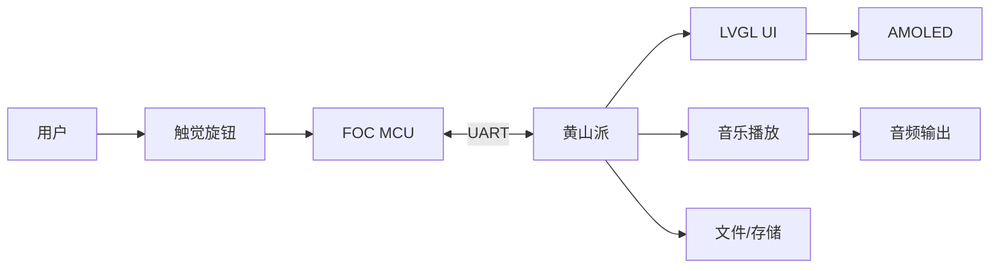
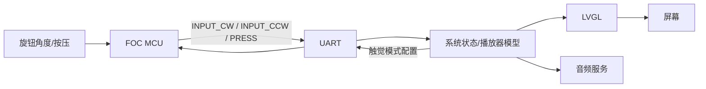
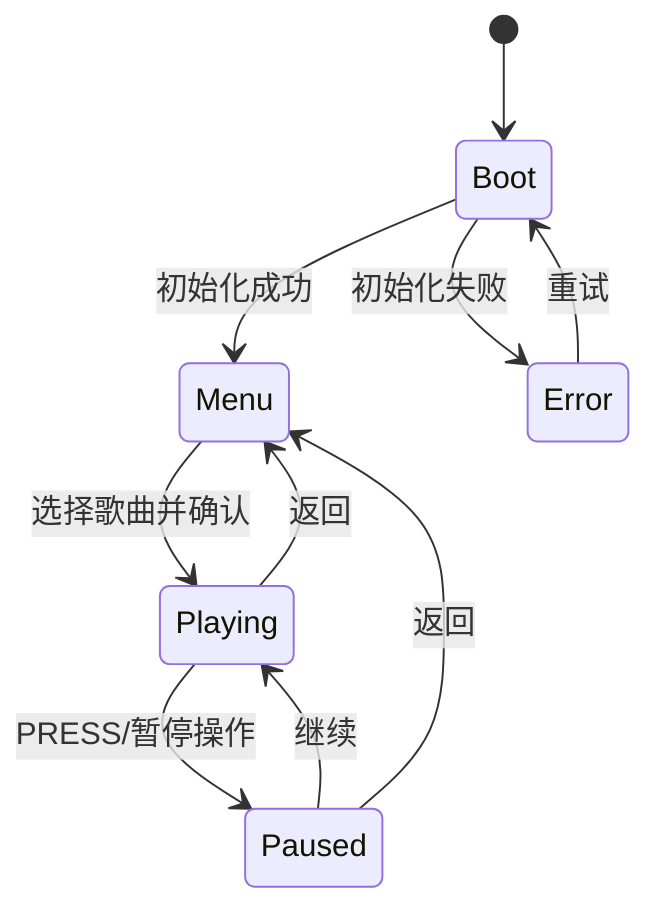

# HapticPod 方案设计

状态：草案

## 1. 设计原则

- 先最小闭环，再加功能；
- UI 不直接依赖具体输入硬件；
- 高速 FOC 控制与黄山派 UI/音频任务解耦；
- 错误和断连有明确状态；
- 真实实现与第三方能力边界清楚。

## 2. 初步系统架构



说明：

- 黄山派：UI、系统状态、音乐、动画、与 FOC MCU 通信；
- FOC MCU：编码器采样和电机高速闭环；
- 具体芯片/驱动板待预研后确定。

## 3. 统一输入抽象

UI 层尽量只消费：

```c
INPUT_CW
INPUT_CCW
INPUT_PRESS
INPUT_BACK
```

开发早期可由按键产生这些事件；后期再替换为真实旋钮输入。

## 4. 数据流（初稿）



## 5. 状态机（示例初稿）



最终状态需要随着实际功能更新。

## 6. 软件模块候选

```text
src/
├── app/
│   ├── app_model.*        # 系统状态/业务规则
│   └── app_events.*       # 统一事件
├── ui/
│   ├── ui_main.*
│   └── ui_pages/...
├── services/
│   ├── audio_service.*
│   ├── storage_service.*
│   └── knob_link_service.*
└── platform/
    └── board-specific wrappers
```

具体目录应尊重老师脚手架已有结构，不要为了“架构漂亮”强行重构。

## 7. 线程与阻塞原则

依据课程脚手架设计要求：

- LVGL 由 UI 线程操作；
- 耗时任务不要直接放 UI 回调；
- 后台任务通过消息或受保护的数据交换结果；
- 网络、长时间采样、模型推理等不应阻塞 UI。

HapticPod 后续也应把音频、存储、通信等耗时工作与 UI 解耦。

## 8. 待验证的设计问题

- [ ] 音频模块具体 API 与线程模型
- [ ] 文件系统/存储方案
- [ ] UART 协议格式
- [ ] FOC 控制器具体硬件
- [ ] 编码器型号和采样延迟
- [ ] 旋钮按压方案
- [ ] UI 动画性能上限
