# Peripheral Lab · 黄山派外设验证台

> 后续 agent / 维护者先读 [接手记录与已确认经验](docs/agent-handoff.md)：当前选择、实测边界、构建命令及 SDK 排查入口。

基于 **SiFli SDK v2.5.1 / LVGL v9 / sf32lb52-lchspi-ulp**，面向 390 × 450 屏幕。每个外设独立测试、显示结果，并提供操作提示和 API 摘要。深色卡片界面使用 SDK 内置英文字体，学习说明和源码注释使用中文。

## 界面与操作

| 首页 | 测试反馈 | 触摸覆盖 |
| --- | --- | --- |
| 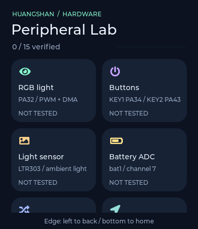 | 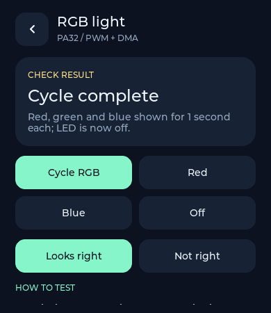 | 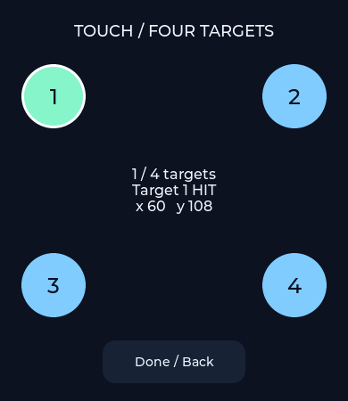 |

连续光照与双指跟踪：

| 连续采样 | 双指跟踪 |
| --- | --- |
| 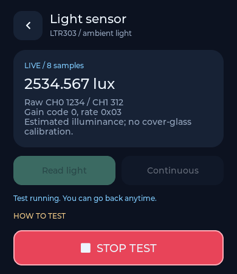 | 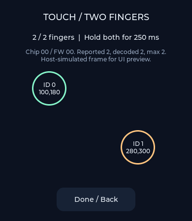 |

| 六轴物理量 | 麦克风电平 |
| --- | --- |
| 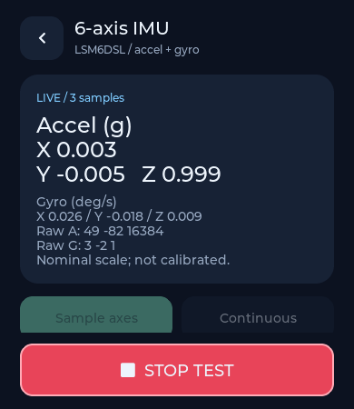 | 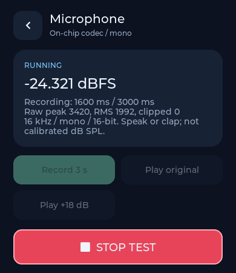 |

扬声器音量、频率调节及八音阶测试：

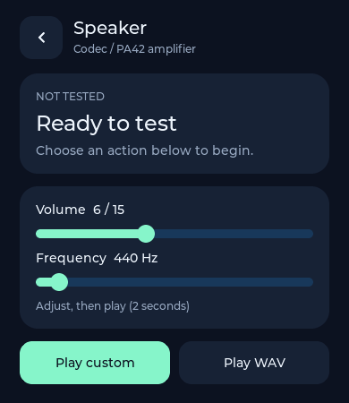

以上是同一份 UI 源码经 LVGL 软件渲染得到的主机预览；结果页使用模拟数据，不代表硬件测试结果。

- 首页上下滑动选择外设，进入详情页后点击操作按钮。详情页可继续滑动查看操作步骤和 **LEARN THE API**。
- **边缘导航**：从左侧 24 px 边缘向右滑至少 60 px 返回上一层；从底部 24 px 边缘向上滑至少 70 px 回首页。方向需明显横向/纵向，不要求快速滑动。页面中部的快滑、慢拖均保留给列表和测试操作。
- 硬件测试在后台串行执行；运行中仍可返回首页、浏览其他测试，操作按钮暂时禁用。
- **停止按钮**：运行中显示高对比红色 STOP TEST，固定在页面底部；详情滚动时依然可见。
- **连续采样**：ADC、六轴 IMU、三轴磁场、光照页面均有 Continuous；实时更新值和样本计数，采样间隔约 500 ms 加本次 I/O 时间。点击 Stop 或离开详情页停止，保留最后一次结果；采样失败自动退出并显示 FAIL。
- `NOT TESTED` 未测试；`RUNNING` 进行中；`PASS` 达到该测试的判定条件；`FAIL` 失败，可重试。
- `CHECK RESULT` 需要观察实物，然后点 **Looks right / Not right**。成功发送命令不会直接判定灯、马达或显示屏正常。
- 首页文字显示通过数，进度条显示已完成判定的数量（通过 + 失败）。结果保存在 RAM，重启清空。
- 屏幕和触摸测试的 **Done / Back** 可随时退出；未完成覆盖的测试回到未测试状态。
- 每次状态变化输出串口日志：`[lab:模块名] state=状态编号 结果 | 详情`，状态编号依次为 0～4。

## 测试覆盖与接线

覆盖本仓库现有示例涉及的主要板载外设，并增加 RTC、屏幕、触摸交互验证；不是对芯片所有接口的穷举测试。

| 测试 | 资源 / 引脚 | 操作与判定 |
| --- | --- | --- |
| RGB | PA32 / `pwmt2` CH1 / `rgbled` | 红绿蓝各 1 秒后熄灭；也可单独红、蓝、关灯；人工确认 |
| GPIO / 马达 | PA20 | 200 ms 高电平脉冲后自动 LOW，或直接 LOW；人工确认 |
| KEY1 / KEY2 | PA34 / PA43 | 各自独立按钮，8 秒内检测释放→按下→释放；20 ms 采样，连续 3 次消抖。KEY1 为电源键，仅短按，保持 BSP 引脚配置 |
| 电池 ADC | `bat1` / 通道 7 | 读取电压；通过只表示采集成功，校准需对照万用表 |
| UART TX | `uart2` / PA19 TX | 115200 8N1，每秒发送一次 `LAB-TX` + CRLF，共 3 次，接收端观察后人工确认 |
| UART RX | `uart2` / PA18 RX | 115200 8N1，8 秒内从终端发送 `LAB-RX` + LF（7 字节，无 CR）；精确匹配通过 |
| UART 回环 | `uart2` / PA19 TX、PA18 RX | 先断开外部发送端，再用跳线连接 PA19 与 PA18；115200 波特率，1.5 秒内完整回收并逐字节比对 |
| 充电芯片 / I2C | I2C2 / AW32001 / 0x49 | 读取 ID、状态；通过表示总线访问成功，不表示充电性能正常 |
| 加速度 / 陀螺仪 | I2C3 / LSM6DSx / 0x6A | 显示 g、deg/s 与原始六轴；采样后恢复设置 |
| 环境光 | I2C3 / LTR303 / 0x29 | 核对 ID，显示估算 lux、CH0/CH1 原始值及增益/积分配置 |
| 磁场 | I2C3 / MMC5603 / 0x30 | 核对 ID、单次测量，显示 uT 和居中后的 20 位原始计数 |
| RTC | `rtc` | 间隔 1.2 秒读两次，时间增加 1～2 秒通过；不校准或设置日历 |
| 显示 | CO5300 / SDK LCD 驱动 | 依次显示红、绿、蓝、白、黑；全部浏览后人工确认 |
| 单点触摸 | FT6146 / SDK LVGL 输入驱动 | 四个目标各点击一次；已命中目标变绿，最近目标显示白色边框，并显示 Target 编号和坐标 |
| 双点触摸诊断 | FT6146 / SDK 原始帧旁路观察 | 同时检测两个不同触点 ID，连续至少 250 ms 后通过；继续显示两个触点的 ID、坐标和位置标记，退出时停止；报告数、ID、固件版本和原始帧用于排查只报单点的情况 |
| 麦克风 | 片内 codec / MIC0 | 16 kHz、16 位单声道录音 3 秒，显示 dBFS、PCM 峰值/RMS/削顶计数；原声 / +18 dB 增强回放对比后人工确认 |
| 扬声器 | 片内 codec / PA42 功放 | C4 到 C5 的八个音阶按钮（一个八度），各播放正弦音 2 秒，带淡入淡出，人工确认声音；支持停止并恢复音量 |

### UART 接线与串口复用

TX 测试：PA19 接接收设备 RX，并共地。RX 测试：发送设备 TX 接 PA18，并共地，使用 3.3 V TTL 电平。回环时不要把仍在驱动 PA18 的外部发送器和 PA19 输出短接。

PA18/19 同时也是 BSP 的 UART1 调试串口引脚。测试窗口临时切换到 UART2 / 115200；窗口结束（含失败、停止）关闭设备并恢复 UART1 引脚复用，调试输出恢复原波特率。测试窗口内日志以 UI 为准，TX 测试需在对端确认完整帧，不能把写缓冲成功当作链路正常。RX 实际收到的字节在恢复后以十六进制输出到调试串口。

同一模块内多个操作共享最近一次结果；例如 KEY1 的测试结果会替换 KEY2 的最近结果，UART 的 TX/RX/回环也是如此。

I2C3 使用 **PA40 SCL / PA39 SDA**。电源、LCD、触摸和总线底层初始化沿用板级 BSP。充电测试模块仅执行读操作；SDK BSP 启动阶段仍会按原有流程配置充电芯片。

传感器通过表示 ID、通信与数据采集流程成功，需移动、遮挡或改变磁场后再次采样检查响应；物理量使用器件标称灵敏度，未做整板校准。单点测试是基本位置覆盖；双点诊断最多解码两个触点，不将 SDK 缓冲区大小视为当前屏幕支持双点的保证，也不做全屏精度校准。屏幕测试保留标题、提示和返回按钮，不能覆盖这些控件遮住的每个像素。

PA34 是电源/下载复用的 KEY1，本项目只读其电平，不重新配置上下拉，也不启用外部 ADC；不要长按 KEY1，以免触发硬件电源行为。RGB 保留已经在本板验证过的 **UPDATE DMA** 配置；测试配置中的 `dma_type = 0` 对应 UPDATE。

## 物理量与音频说明

- 六轴采样配置为 ±2 g、±245 deg/s。加速度换算 `raw × 0.000061 g`，角速度换算 `raw × 0.00875 deg/s`。静止时重力轴接近 ±1 g，角速度接近 0；偏置未校准。
- MMC5603 20 位数据先减去 524288，再按 `raw × 100 / 16384 uT` 换算；未补偿硬铁、软铁和零场偏差，不输出伪精确航向。
- LTR303 按 Lite-On Appendix A 的 CH1/(CH0+CH1) 分段式换算；使用数据状态里的实际增益和寄存器里的积分时间，按手册规则限制积分时间不超过测量周期。饱和、保留增益或红外占比超出有效区间时显示 Lux unavailable，继续显示原始值。没有盖板透光率校准。
- 电池 ADC API 已输出 0.1 mV 单位的校准值，界面同时显示该 SDK 数值与 V；不把它谎称为原始 ADC 码。
- 麦克风 dBFS 是去直流后的 PCM RMS 相对数字满量程的电平；不是声压级 dB SPL。峰值及削顶计数为原始 PCM 指标。数据全零或不足 2.5 秒时报告失败；有 PCM 也需要回放确认人声。
- 录音缓冲按需分配 96000 字节，保留在 RAM 供回放，新录音覆盖旧录音，重启清空；不写文件或上传。先接好板上喇叭接口，再测试回放。
- 扬声器测试使用片内 codec 和 BSP 已配置的 PA42 功放，麦克风回放音量临时设为 6/15；扬声器页面提供 0–15 音量条（0 为静音，默认 6）和 100–4000 Hz 频率条（默认 440 Hz）。调好后点 Play custom 播放 2 秒，八音阶按钮同样使用所选音量，并将频率条同步到该音阶。播放期间锁定滑条，结束后恢复之前的有效系统音量；测试设置在页面切换后保留，重启恢复默认。PCM 写入处理部分写入和缓冲区满，1.5 秒无进展则退出；底层 open/close 的执行时间受 SDK 驱动约束。

### 录音远处听不清的诊断

当前录音没有启用 3A/AGC，保留原始 PCM；回放音量为 6/15。因此仅凭回放小声不能判断麦克风损坏。录制时分别在安静环境、近处和 30–50 cm 处以相近音量说话，观察原始 RMS/dBFS 是否随人声明显变化。录完对比 **Play original** 与 **Play +18 dB**：后者仅对回放乘以 8，并饱和限幅，不修改原始缓冲，也不提高麦克风硬件灵敏度。增强回放会同时放大底噪；削顶计数非零时以原声判断失真。

若远处的原始电平有响应、增强后可听清，应先调录音增益/回放链路；若说话与静音的电平几乎无区别，再检查拾音孔、板上麦克风供电、codec 输入增益及硬件。dBFS 不能单独换算声压级，尚无上板远场验证结论。

## 双指始终显示 1 的排查

新版读取 **SDK 实际采集的同一帧**，不再并行读取数据寄存器；屏幕显示芯片 ID、固件版本、Reported、Decoded、Max。串口每秒输出 `[lab:touch-frame] seq=... raw: ...`。

1. 放两个手指并轻微移动，观察 Reported 与 Max。
2. 若 Reported 达到 2 而 Decoded 不到 2，保留完整原始帧，检查触点槽位、事件和坐标格式。
3. 若 Reported/Max 始终为 1，只能说明当前固件采集到单点，不能靠增加 UI 圆圈或将缓冲区改大证明双点支持；需结合屏幕型号、触摸固件及供应商资料继续确认。
4. 超过 5 秒没有 SDK 帧会报错；退出时未验证两点则显示 FAIL，保留 ID/FW/Max，不能手工把该结果确认成通过。

尚未上板验证这次采集改动，不能宣称双指硬件问题已经解决。

## 构建

推荐在 VS Code / SiFli SDK CodeKit 中打开 `peripheral_lab/project`：

1. 激活 SDK **v2.5.1**。
2. 选择板型 **sf32lb52-lchspi-ulp**。
3. 执行编译。需要上板验证时，再选择正确串口执行下载。

已激活 SiFli SDK 环境的终端也可以执行：

```sh
cd peripheral_lab/project
scons --board=sf32lb52-lchspi-ulp -j8
```

构建产物在 `project/build_sf32lb52-lchspi-ulp_hcpu/`。下载应使用 CodeKit/SDK 生成的完整下载配置，它包含启动程序、分区表和应用；不要只凭猜测写入单个 bin 地址。

## 模块结构与学习顺序

```text
project/                 SCons、Kconfig 和项目功能配置
src/main.c               LVGL 初始化与 UI 主循环
src/lab.h                测试 ID、结果结构和模块接口
src/lab.c                后台任务、状态锁、结果发布
src/lab_registry.c       卡片信息、提示、API 摘要和动作注册
src/lab_bus.c            I2C 寄存器访问与数据就绪轮询
src/lab_ui.c             首页、详情、状态刷新、全屏测试层
src/modules/test_*.c     每个外设独立实现
src/modules/touch_decode.c  FT6146 触点槽位解码
src/modules/touch_capture.c SDK 读帧观察钩子，不额外读取触摸数据
src/lab_units.c           单位换算、定点格式化，可独立主机测试
src/lab_audio.c           PCM 回放、音量和停止管理
src/modules/test_mic.c    录音回调、PCM 电平与录音回放
src/modules/test_speaker.c 测试音入口
tests/                   主机 UI 交互验证与渲染（不进入固件构建）
```

建议先看 `test_gpio.c` → `test_adc.c` → `test_uart.c` → `lab_bus.c` / 传感器模块，最后看 UI 和任务协调。

### 线程与资源约定

- **只有 UI 主线程操作 LVGL**。硬件工作线程优先级 22，每次执行一个动作；它通过 `lab_publish()` 发布有锁的结果快照。
- UI 每 100 ms 读取结果变化，主循环按 LVGL 建议等待 2～20 ms。硬件的延时和轮询不放到 UI 回调里。
- 传感器就绪轮询、UART 接收、按键采样有时限；I2C 单次传输也受 SDK 驱动超时限制，总耗时可能超过就绪轮询的标称时限。
- 离开详情页自动停止连续采样；退出双点测试也会停止原始帧采集。普通单次测试仍可在后台完成。Stop 在安全边界生效，不强行中断底层 I/O；按键/RX 等待支持主动停止，I2C 故障时需等待驱动超时与设置恢复。
- ADC 读完关闭通道，UART 结束关闭设备，IMU/ALS 恢复采样配置，马达脉冲后返回低电平。RGB 的单色动作保持颜色，结束使用时点击 Off。
- 双点诊断保留 SDK 单指输入通路，用 GCC 链接器 `--wrap=rt_i2c_transfer` 观察 SDK 的 0x01 起始读帧；只有一次底层传输，不再由后台线程另读触摸数据。钩子只复制数据，不修改 SDK 缓冲区、不抢占触摸 IRQ。解码检查触点数、坐标、事件、重复 ID，并处理第一槽位释放、第二槽位仍按下的情况。双指操作期间屏蔽导航识别，抬起后可用单指边缘手势退出，Done 按钮始终可用。
- `rt_i2c_mem_read(..., reg, 8, ...)` 使用 SiFli 的寄存器访问方式，在地址与数据之间保持 repeated START。
- 禁用休眠，避免验证途中屏幕熄灭；不用于评估低功耗表现。

### 增加一个测试项

1. 在 `lab.h` 的 `lab_id_t` 中增加 ID，放在 `LAB_COUNT` 之前，并声明运行函数。
2. 新建 `src/modules/test_xxx.c`，实现 `void lab_xxx_run(unsigned action)`。该目录的 C 文件会自动参与构建。
3. 在 `lab_registry.c` 添加名称、图标、颜色、操作步骤、API 摘要、最多 4 个按钮及运行函数，并将新 ID 加入 `lab_ui.c` 的首页 `order` 数组。
4. 配置 `project/proj.conf` 中所需驱动。在模块内检查错误，释放资源，并发布最终 `PASS` / `FAIL` / `OBSERVE`。
5. 需要观察实物时用 `LAB_OBSERVE`，不要把命令发送成功等同于外设正常。后台模块不要调用 LVGL。

示例：

```c
void lab_example_run(unsigned action)
{
    (void)action;
    /* 调用设备 API，检查返回值，结束前释放资源。 */
    lab_publish(LAB_EXAMPLE, LAB_OBSERVE, "Command sent", "Confirm the physical response.");
}
```

## 主机验证

使用 SDK 自带的真实 LVGL 源码、生产 UI 和显示/触摸模块，模拟后台硬件结果。需要 Python 3 和本机 C 编译器，无需连接板卡：

```sh
python3 peripheral_lab/tests/render.py --sdk /path/to/SiFli-SDK/v2.5.1
```

macOS 若使用独立 Command Line Tools，可指定编译器和 SDK：

```sh
CC=/Library/Developer/CommandLineTools/usr/bin/clang \
CFLAGS='-isysroot /Library/Developer/CommandLineTools/SDKs/MacOSX.sdk' \
python3 peripheral_lab/tests/render.py --sdk /path/to/SiFli-SDK/v2.5.1
```

默认输出 `/tmp/peripheral-lab-preview/`，包括首页、详情、结果、触摸的 PPM 图片。用 `--out` 更改目录。

交互检查覆盖 16 个详情页往返、边缘快/慢滑导航、中部快/慢滑不导航、连续采样离页停止、双指跟踪/手势屏蔽、单点重复点击/完成，以及原始帧的越界/重复 ID/释放数据。另用 POSIX 线程替代 RT-Thread 原语运行真实 `lab.c`，验证连续采样、并发请求拒绝、停止、再次启动和采样错误退出。另验证单位换算边界、触摸钩子单次传输、音频部分写入/缓冲区满/超时/停止/音量恢复。触摸事件和硬件数据由测试代码注入，不验证真实 I/O、麦克风声学效果、硬件触控或 RT-Thread 调度。

**当前验证：** v2.5.1 目标编译通过，主机 UI 交互断言通过，新版首页、连续光照/六轴、麦克风、单点和双点渲染图已检查。SDK/工具链仍有自身的链接警告（RWX 段、newlib syscall stub、FTAB entry）；不将编译成功当作硬件验收。本次未烧录，实际帧率、屏幕输入和各外设须上板逐项确认。

## 寄存器参考

- [LTR303 数据手册](https://optoelectronics.liteon.com/upload/download/DS86-2013-0004/LTR-303ALS-01_DS_V1.1.PDF)
- [MMC5603NJ 数据手册](https://www.memsic.com/Public/Uploads/uploadfile/files/20220119/MMC5603NJDatasheetRev.B.pdf)
- [Lite-On LTR303/329 Appendix A（厂商文档镜像）](https://github.com/latonita/datasheets-storage/blob/main/sensors/LTR-303%20329_Appendix%20A%20Ver_1.0_22%20Feb%202013.pdf)
- [ST LSM6DSL 灵敏度定义](https://github.com/STMicroelectronics/stm32-lsm6dsl/blob/main/lsm6dsl.h)
- LSM6DSL 寄存器定义：SDK `customer/peripherals/sensor/LSM6DSL/libraries/lsm6dsl_reg.h`。

### 已收到的触摸实测日志

`Chip 64 / FW 05 / max reported 1` 表示本次测试控制器最多报告一个触点。
示例 `00 41 29 01 05 00 00 FF FF FF FF FF FF`：首字节为 0（当前无有效触点），第一槽位是 (297, 261) 的抬起事件，第二槽位全 FF 无有效触点；这不是双指帧被 UI 丢弃。
当前面板/固件未验证双指支持，不能仅凭 ID 0x64 或驱动支持两个槽位确定芯片硬件能力。需要屏厂确认该面板及固件的触点规格；不尝试未知寄存器或刷写触控固件。

## WAV 播放测试

Speaker 页提供 **Play WAV**，播放内置的两秒原创提示旋律 `assets/speaker.wav`。使用音量条设置（0–15），频率条仅影响自定义测试音；可用 STOP TEST 提前停止。结束后人工确认声音，SDK 写入成功不等于硬件音质通过。

`src/lab_wav.c` 解析 RIFF/WAVE、fmt 和 data 块，跳过带偶数字节填充的未知块，验证长度及格式。当前支持 **PCM 编码、16 kHz、单声道、16 位**；不支持浮点、压缩或其它采样率。资源编译进 Flash，无需文件系统；分块送入音频服务，不为整段 WAV 再分配 RAM。

替换测试音频（在项目根目录运行，之后重新编译）：

```sh
python3 peripheral_lab/tools/generate_wav.py --input /absolute/path/to/example.wav
```

该命令校验格式并更新 `assets/speaker.wav` 和 `src/lab_wav_sample.inc`；不带参数时重建原创提示旋律。较长文件会增加固件 Flash 占用，请以编译容量检查为准。

## 蓝牙扩展规划

参见 [蓝牙能力核对与测试规划](docs/bluetooth-test-plan.md)。BLE 基础测试与 BTPAN 联网测试已实现，使用方法见 [BLE 测试说明](docs/ble-testing.md) 和 [BTPAN 联网测试](docs/pan-testing.md)；规划中的经典蓝牙音频、通用 GATT Client 浏览等尚未实现。

### BLE 基础测试界面

| 状态与广播 | 扫描 | 配对确认 |
| --- | --- | --- |
| 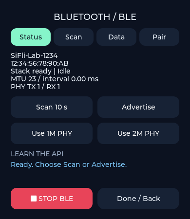 | 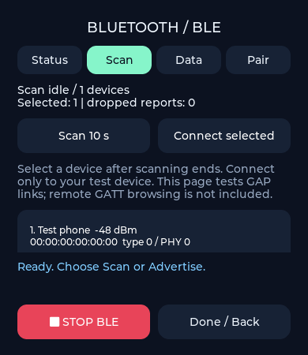 | 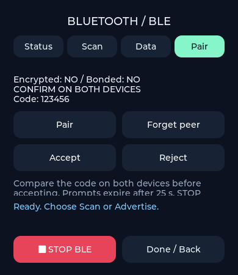 |

以上为主机模拟预览，实际连接及配对需要上板验证。

## MQTT 联网测试

PAN 获取 IP 后点击 **Test MQTT**，连接公共 Broker 并执行发布/订阅精确回环。见 [MQTT 测试说明](docs/mqtt-testing.md)。

## 综合测试：鹈鹕自行车

首页最后的 **Play Lab → Pelican ride**：倾斜板子控制鹈鹕骑自行车，双腿随速度交替踩踏，收集小鱼、避开路障、保持平衡。进入即显示游戏并取当前握姿为中立点，支持屏幕上下/左右移动、转向、暂停、倒退和结算后重玩；采用顶部悠闲天空背景、底部两行悬浮状态及速度里程信息，常驻仅一个暂停按钮；居中、重玩、退出收进暂停菜单，Center 居中后直接恢复游戏，支持边缘手势返回。偶尔出现的绿色补给包可增加 1 HP（上限 5），菜单滑条可选择轻松/普通/挑战难度。出发、收鱼、回血、碰撞和结算配有短音效，音量在游戏菜单 Sound volume 滑条控制（0 为静音），暂停/退出会停止。玩法、实现和验证边界见 [Pelican Post](docs/pelican-ride.md)。初版板端体验问题已记录并修正；新版已编译及主机验证，本次未烧录，修正后的板端手感待复测。
