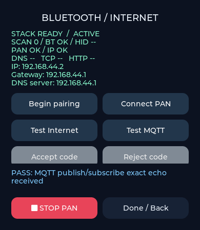

# MQTT 发布/订阅回环测试

入口：**Bluetooth Internet → Open PAN tests → Test MQTT**。继续使用已在 Android/iPhone 上测试通过的 HID 辅助 PAN 连接。

## 板端步骤

1. 手机开启蓝牙网络共享/个人热点，在板端 Begin pairing 并完成连接。
2. 等待 PAN、IP 显示 OK；HTTP 测试可先运行，但不是 MQTT 的前置条件。
3. 点击 **Test MQTT**，底部显示当前步骤。内容区向上滚动可查看 MQTT 分阶段结果及说明。
4. 只有收到本次主题和负载完全匹配的非 retained 消息，且发送 DISCONNECT 后，才显示 **PASS: MQTT publish/subscribe exact echo received**。
5. 可再次点击重新测试。HTTP 与 MQTT 串行运行，进行中重复点击不会创建第二个请求。STOP PAN 或离开页面会关闭请求并断开 PAN。

## 目标与判定

- Broker：`test.mosquitto.org:1883`，公开、匿名、明文 TCP。
- 协议：MQTT 3.1.1，Clean Session，QoS 0，非 retained。
- 流程：DNS → TCP（绑定 PAN 本地 IP）→ CONNECT/CONNACK → SUBSCRIBE/SUBACK → PUBLISH → 回收匹配消息 → DISCONNECT。
- 每轮生成客户端标识与专用主题 `sifli/lab/<client-id>/echo`，只订阅自己的完整主题，不订阅通配符。ID 使用本地地址哈希、启动 tick 和序号区分设备/轮次，并非加密随机身份。
- 只发送合成测试字符串；客户端标识、主题和内容打印到 `[lab:mqtt]` 串口日志。公共 Broker 上其他人可读取或向主题发布数据，回环通过不代表认证或安全验证。
- DNS 10 秒、TCP 8 秒、每个 MQTT 发送/应答阶段 8 秒超时。忽略不匹配或 retained 消息不会延长等待时间。测试后关闭 socket，Clean Session 不保留订阅。
- CONNECT/SUB/TX 是本轮已完成的步骤，不表示测试结束后仍在线。HTTP 与 MQTT 保留各自最后结果；DNS/TCP 显示最近一次网络测试进度。

测试不覆盖 TLS、用户名/密码、QoS 1/2、断线自动重连、长期保活或性能。公共 Broker 可能维护或限流，运营商也可能限制 1883；MQTT 失败但 HTTP 成功不代表 PAN 损坏。此示例是有界的一次性测试器，不替代完整生产 MQTT 客户端。

## 模块与学习 API

- `src/network/lab_mqtt.c/.h`：与 RTOS 无关的报文编码、TCP 分包/粘包解析、ACK 校验与精确回环判定。
- `src/network/lab_pan_net.c`：复用 PAN 网卡、异步 DNS、非阻塞 socket、部分发送处理、超时与取消。
- `src/lab_pan_ui.c`：Test MQTT 按钮及 CONNECT / SUB / TX / Exact echo 反馈。

关键 API：`lab_mqtt_start()` → 发送 `tx` → `lab_mqtt_sent()` → `lab_mqtt_feed()`。发送必须完成整个报文后才能调用 `lab_mqtt_sent()`。网络事件、UI 更新分别在原有任务中处理，MQTT 不直接调用 LVGL。

## 验证

- v2.5.1 固件目标编译通过。
- 主机协议测试：报文流程、分包/粘包、retained/内容不符、拒绝或错误 ACK、长度越界。
- 生产 `lab_pan_net.c` 配合替身传输测试：两字节部分发送、单字节接收、完整 MQTT 回环、HTTP 回归、STOP 关闭 socket/恢复路由、迟到 DNS、发送超时与 IP 丢失。
- 真实公共 Broker 桌面测试：复用生产 MQTT 协议模块，实际收到精确回环并断开。使用桌面网络，不是板子或 PAN。
- 生产 LVGL UI 按钮路由和结果截图验证通过。

**本次未烧录，MQTT 经板子 → 手机 PAN 的实测仍待用户完成。**

可选桌面联网探针（会向上述公共 Broker 发布一条合成消息）：

```sh
CC=/Library/Developer/CommandLineTools/usr/bin/clang \
CFLAGS='-isysroot /Library/Developer/CommandLineTools/SDKs/MacOSX.sdk' \
python3 peripheral_lab/tests/mqtt_probe.py
```



## 参考

- [Mosquitto 公共测试服务器端口与使用说明](https://test.mosquitto.org/)
- [OASIS MQTT 3.1.1 规范](https://docs.oasis-open.org/mqtt/mqtt/v3.1.1/os/mqtt-v3.1.1-os.html)
