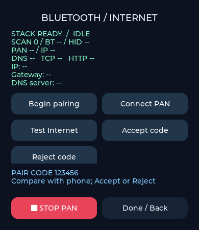

# BTPAN 联网测试

BTPAN 使用经典蓝牙 PANU，通过手机的 Bluetooth tethering/NAP 接入网络。与 BLE 广播/GATT 测试是不同功能。

名称在协议栈就绪时生成，配对前即可在本页顶部看到名称和完整 MAC。后缀为常规 MAC 显示顺序的末 6 位大写十六进制字符，例如 `11:22:33:A1:B2:C3` → `SiFli-Lab-A1B2C3`。串口输出 `[lab:pan:identity] MAC=... name=...`；BLE 测试也使用相同后缀规则。读取地址失败时不开放 PAN 配对，可点击 Begin 重试。

## 操作步骤

1. Android 手机先确认自身可以上网，在热点/网络共享设置中开启**蓝牙网络共享**。不同品牌菜单名称可能不同。
2. 板子打开 **Bluetooth Internet → Open PAN tests → Begin pairing**。
3. 在手机系统蓝牙设置搜索板端页面顶部显示的 **SiFli-Lab-XXXXXX**。比较双方配对数字，板子点 **Accept code**，手机也确认。发现窗口 60 秒、确认窗口 25 秒。
4. 加密连接后等待约 3 秒，程序请求 PAN 连接。也可手动点 **Connect PAN**；该按钮需要已有手机蓝牙连接。
5. 等待 PAN、IP 显示 OK，核对 IP、网关、DNS，然后点 **Test Internet**。
6. DNS、TCP、HTTP 逐层显示结果。**STOP PAN**、返回按钮或退出边缘手势会停止网络请求、关闭经典蓝牙可发现模式、断开 PAN/ACL；保留配对记录。

已配对手机重新测试时，先 Begin，再从手机设置连接；没有蓝牙基础连接时 Connect PAN 不会主动搜索旧手机。若断开超时，请查看串口并重启板子。当前默认保留 PAN + HID 版本（已提交 `a010ec4`）；已验证的 PAN + A2DP Sink 版本保存在 Git 提交 `7414f46`。

## iPhone 重测步骤

1. 更新固件后，在 iPhone 蓝牙设置中忽略旧的蓝牙配对记录（旧固件名 SiFli-Lab-PAN）（如果存在）。首次更换 Profile 后建议重新配对，避免旧服务缓存。
2. 开启蜂窝数据、个人热点中的“允许其他人加入”，再进入蓝牙设置。
3. 板端 Stop → Begin pairing，手机重新搜索并配对；比较双方数字后确认。
4. 确认 SCAN 为 3（可发现、可连接），观察 SCAN / BT / HID / PAN / IP。HID 是用于连接兼容性的辅助 Profile，不是联网成功条件；DNS/HTTP 必须实际通过才判定联网成功。
5. 若仍失败，保留 `[lab:pan:event]`、`[lab:pan:pair]`、`[lab:pan:profile]` 和断开 `0xNN` 原因码的串口日志，并记录 iOS 版本。

当前版本保留 HID 配置：开启 PAN/HID、关闭 A2DP；设备类别恢复 LAN Access Point + Networking，EIR 恢复仅名称，未额外加入 HID UUID。保留新增加的 SCAN 状态与诊断日志。这套配置已获得用户 Android/iPhone 联网成功反馈。

SDK HID 会在连接时自动发送鼠标校准报告，本项目恢复链接包装：屏蔽主动输入，控制通道 Input 应答使用中立值。STOP 断开 HID、PAN 和基础连接。

### 历史对照方法（仅在重新比较 Profile 时使用）

1. 若要控制缓存变量，可在各待测版本烧录后使用相同的忽略设备、重启手机与板子的步骤；这不是日常连接必须执行的操作。
2. 开启个人热点“允许其他人加入”，板端 Begin pairing，确认 SCAN 3。
3. 记录是否发现、是否配对、是否 PAN/IP 成功、是否 HTTP 200。
4. 若成功，不再重启手机，STOP → Begin → 重新连接，重复 HTTP 测试。
5. 失败时保留完整串口日志和 iOS 版本；不把失败直接归因于 HID，因为设备类别、EIR 和缓存也会影响结果。

A2DP 基线：Git 提交 `7414f46`，已收到用户 iPhone 首次成功与重复成功反馈。需要恢复时从该提交建立独立工作区再编译，可保留当前对照代码。

## 判定与排障

| 阶段 | 含义 / 排障 |
| --- | --- |
| BT | 收到经典蓝牙基础连接事件，不代表网络共享已启用 |
| PAN | 收到 PAN Profile 成功事件；15 秒连接超时后检查手机共享开关 |
| IP | PAN 网卡取得非零 IPv4 地址；30 秒无地址检查 DHCP/手机共享 |
| DNS | example.com 解析得到 IPv4；可能使用 lwIP DNS 缓存 |
| TCP | 绑定 PAN 本地 IP，连接解析地址的 TCP 80 端口 |
| HTTP | HEAD 请求收到 HTTP 200/204 首行，测试通过；重定向或错误状态不通过 |

DNS 超时 10 秒，TCP 8 秒，HTTP 发送/接收阶段共 8 秒。失败细节显示在底部，也输出 `[lab:pan]` / `[lab:pan:net]` 串口日志。手机移动网络、DNS、防火墙和目标网站策略都可能影响结果；一次失败不能直接判定蓝牙硬件损坏。

该测试会向 `example.com:80` 发送一个不含业务数据的 HTTP HEAD 请求，可能使用手机流量。它验证该目标的明文 HTTP 可达性，不验证 HTTPS、证书、吞吐量或整个互联网；收到 HTTP 首行也不验证响应正文。局域网代理可能影响判定。

## 模块与 API

- `src/network/lab_pan_service.c`：SDK 经典蓝牙回调复制到消息队列；专用任务处理配对确认、PAN 连接和停止。LVGL 只读互斥锁保护的快照。
- `src/network/lab_pan_net.c`：在 lwIP tcpip 线程访问网卡/DHCP/DNS；独立任务轮询非阻塞 socket。暂时使用 PAN 默认路由，停止时恢复仍存在的旧路由。会话编号丢弃迟到 DNS 回调。
- `src/network/lab_pan_identity.c`：恢复此前 LAN/Networking 设备类别。
- `src/network/lab_pan_hid_compat.c`：屏蔽 SDK 自动鼠标输入，保留中立控制应答。
- `src/network/lab_pan_model.c`：HTTP 首行状态码解析。
- `src/lab_pan_ui.c`：状态、操作、配对数字、醒目停止按钮。内容区可上下滚动查看说明。
- `src/network/lab_pan_audio_compat.c`：SDK 2.5.1 的 `audioproc.h` 以 `BT_FINSH` 判断语音支持，导致仅启用 PAN 时音频服务引用缺失的语音函数。仅在 HFP 和蓝牙音频均禁用时提供两个空处理入口；启用这些功能后由 SDK 实现接管。

关键 API：`bt_interface_register_bt_event_notify_callback`、`bt_interface_user_confirm_res`、`bt_interface_conn_ext(..., BT_PROFILE_PAN)`、`dhcp_start`、`dns_gethostbyname_addrtype`、`lwip_socket/connect/select/send/recv`。共享蓝牙栈只初始化一次。

## 验证范围

v2.5.1 目标固件已编译。主机验证覆盖生产 UI 按钮路由、配对提示、停止/返回；HTTP 解析边界；生产 PAN 状态机的配对同意、旧命令取消、防重复连接、退出后迟到连接拒绝、断开清理。PAN 传输与 RTOS 在主机测试中是替身，固件编译核对真实 SDK 接口。

**Android 的此前 HID 版本、iPhone 的 A2DP 版本已有用户实测通过；当前 HID 版本也已收到用户 iPhone 配对联网成功反馈。** socket 状态机仍需通过手机断网、关闭共享、拒绝配对、超时和测试中退出等上板场景验收。此前用户实机联网结果与后续 MQTT 桌面网络测试需分开记录，见下文和 MQTT 专题。

## 用户上板验证结果

- Android：此前 PAN + HID 版本收到 HTTP 200。
- iPhone：PAN + A2DP Sink 版本首次仍未显示设备，重启 iPhone 后配对并收到 HTTP 200；随后不重启手机，重复连接与 HTTP 测试通过。
- 用户换回 HID 后，无需重启 iPhone 即可配对联网。两种辅助 Profile 均已实测可用，之前失败的具体原因仍未确定。当前保留 HID。

以上是用户反馈的实机结果，区别于主机模拟测试。

## MQTT

网络页新增 **Test MQTT**，详见 [MQTT 发布/订阅回环测试](mqtt-testing.md)。

### 2026-09-17 名称变更验证

黄山派目标编译通过，主机回归覆盖地址字节顺序、配对前名称生成、读取失败时禁止 Begin、停止后保留名称；真实 LVGL 软件渲染确认名称/MAC 在页面顶部。BLE 同步使用六位后缀。未烧录，手机发现及板端显示待实测。
