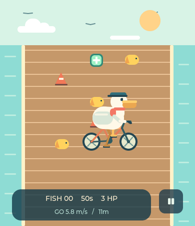
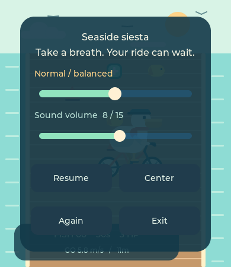

# 综合测试：Pelican Post / 鹈鹕自行车

入口：主页最后一张 **Play Lab** 卡片 → **Pelican ride**。这是综合测试的首个游戏，联动 LSM6DSL、显示、触摸与扬声器短音效；不驱动马达或蓝牙。界面沿用项目内置英文字体，以免中文缺字。

游戏角色现已改骑自行车：双辐条车轮、菱形车架、前叉、鞍座及车把，双腿随曲柄相差半圈交替踩踏。曲柄/轮辐相位由行驶距离驱动，踏频随速度变化，停车和暂停时冻结，倒退时反转；仍直接绘制旋转后的坐标，不创建离屏像素缓冲。

## 怎么玩

- 按习惯握持板子进入，第一帧有效重力数据立即设为中立姿态；不用等待稳定百分比，游戏画面从打开起始终可见。按 **Center** 可随时重新居中。避免握姿俯仰接近 ±90°，该姿势不适合双轴重力倾斜控制。
- 前后倾：控制前进/倒退，鹈鹕会在屏幕上实际上移/下移；角色默认位于画面偏下处，前方展示更长道路；到达可视区域边缘后镜头缓动跟随，并限制角色不越出屏幕。起点也可直接倒退。回到中立姿态会逐渐停车。
- 左右倾：控制车头方向及左右位置，方向参与行驶轨迹，停止时也能转动；倒退时沿车头反方向行驶。高速大幅侧倾会失衡。
- 60 秒、初始 3 HP，最高 5 HP。收集黄色小鱼，避开橙色路障和栈道边缘；碰撞或过度倾斜扣一颗心，随后按难度提供 2.5 / 2 / 1.5 秒保护期。每条鱼仅计分一次。
- 游戏铺满 390 × 450 屏幕，顶部 90 px 保留太阳、白云和缓慢振翅飞过的小鸟，道路从 y=90 延伸到底部；底部半透明信息栏分两行显示鱼数/时间/生命和速度/里程，右侧保留 48×48 暂停按钮（y=377..425，避开底部手势起始区）。暂停菜单中才显示 **Resume / Center / Again / Exit**；Center 点击后在下一有效帧居中，自动关闭菜单并恢复游戏，Resume 恢复时重新取握姿。结算菜单提供重玩和退出。
- 已移除 Flip F/B、Flip L/R、Swap XY；按用户板端运动反馈，将传感器坐标转换为屏幕坐标 `(-Y, +X, Z)` 后再计算倾角和中立姿态。以打开/居中时姿态为基准，按钮端向下倾应向下走，屏幕右侧抬高应向左走，反向倾斜则反向运动。轴符号由既有映射与用户现象推断，尚无原始三轴读数；本轮映射仍待板端复测。
- 左边缘向右滑返回、底边缘向上滑回首页，也可从暂停菜单 **Exit** 退出；已删除常驻 Done / Back。首次进入仅显示 4 秒手势提示，收鱼/碰撞/失衡短暂反馈，速度里程收纳于底部第二行，平衡条不再常驻。退出停止采样并恢复 IMU 原配置。

## 补给与难度

- 薄荷绿色十字补给包：首次位于 34 m，之后每 72 m 一次（约每六组小鱼），位置在不同车道轮换，和路障错开。拾取 +1 HP，最多 5 HP，显示绿色反馈。满血拾取显示 HP full；道具消失，倒退重拾不能重复回血。致命碰撞后不能靠同帧道具复活。
- 暂停/结算菜单增加三档滑条：**Easy / Normal / Hard**。默认 Normal；更改保留本局鱼数、HP、剩余时间和道具状态，重玩/重新进入保留选择，重启后恢复默认。设置仅在当前 RAM 中保存。
- Easy：速度为普通档 75%，转向更柔和，失衡倾角/侧倾容错为 120%，碰撞保护 2.5 s。
- Normal：前进最高 9 m/s、倒退最高 4 m/s，原有转向和失衡容错，碰撞保护 2 s。
- Hard：速度 125%，转向更敏捷，失衡容错 85%，碰撞保护 1.5 s。三档道路边界相同，起始 HP 和时长相同。实际速度还取决于板子倾斜。
- 路线扩为 64 组鱼/路障与 10 个稀疏补给位置，覆盖挑战档 60 s 内最高前进距离。当前视野复用少量 LVGL 对象，不按整条路线分配图形对象。

## 实现与边界

- `modules/test_game.c` 在现有 `lab_io` worker 中独占采样，使用既有 I2C3 / 0x6A 接口。校验 WHO_AM_I，保存 CTRL1_XL/CTRL2_G/CTRL3_C，启用 104 Hz、±2 g、245 dps、BDU、自增；约每 20 ms 读取一帧。超时、读写失败及取消均走配置恢复路径。
- `lab.c` 的同一个互斥锁保护运动快照。进入游戏清空旧快照，普通外设测试在游戏运行期间保持 busy 互斥；LVGL 不执行 I2C。
- `lab_ride.c` 是独立可测试的游戏模型。重力倾角低通滤波，3° 死区；两个重力倾角分别控制转向及速度。heading 参与纵向/横向速度计算，不积分 gyro yaw。它是倾斜游戏，不是完整惯导或真实车辆动力学。
- 居中只需一帧有效重力数据（模长 0.2–2.5 g），不再要求 40 帧静止；入口/恢复/居中时清零控制倾角并提供 1.5 秒碰撞保护。无有效传感器帧时显示场景但不开始计时，断流检查仍然生效。
- `lab_game_ui.c` 以 33 ms 定时器更新原生 LVGL 图元。鹈鹕和车轮由 draw 回调直接画圆头线段，先旋转端点坐标；不使用对象 transform_rotation，也不生成角色离屏图层。界面连续 600 ms 无新帧时停止游戏并提示退出重试。暂停和结算期间仍采样，退出页面后停止。
- 采样异常为 FAIL；正常退出为 CHECK RESULT，须用户确认板端动作后才算综合测试通过，游戏分数不等于硬件 PASS。

## 用户板端反馈与修正（2026-09-17）

初版用户反馈：只能观察到横向运动，无法纵向运动/转向；校准遮罩长时间挡住游戏；Flip 按钮作用不明显且按钮太多。源码核对确认初版角色 Y 坐标固定，道路滚动代替角色纵向位移，转向只有速度相关的小幅倾斜；校准遮罩在 40 帧稳定前始终存在。

本轮增加角色实际纵向位移、边缘跟随镜头、独立 heading 与方向相关的行驶轨迹，改为首帧快速居中，移除遮罩文案和 Flip/Swap 按钮。随后用户反馈进入游戏 hang，日志反复报告 `118x126 / stride 472 / 59472Byte` 申请失败。SDK `lv_obj_style.c` 将非零对象 rotation 判为 TRANSFORM 层，`lv_draw_layer_alloc_buf` 失败后要求稍后重试；原实现旋转整个鹈鹕子树，产生约 59 KB 的临时 ARGB 像素缓冲，桌面主机充足内存掩盖了问题。

内存修正：去掉鹈鹕及轮辐的对象旋转，改为在已有绘图层中直接绘制经过坐标旋转的圆头线段；把角色的多个 LVGL 子对象合成一个绘制对象。保留朝向、双轴移动与滚轮动画，不增加 LVGL 堆或修改 SDK 的重试行为。本轮修正尚待板端复测。

### 屏幕与传感器轴方向修正

用户反馈屏幕竖起且按钮在下时向右走，右侧抬起时向下走。结合旧版 `X → 左右、Y → 前后` 的输出推断，板上安装的平面轴应旋转 90°：屏幕左右分量取 `-sensor Y`，屏幕前后分量取 `sensor X`。转换放在游戏模型的输入处，其他传感器测试仍展示原始物理轴，不修改采样驱动或绘图路径。新增四个正反向姿态的模型回归；主机 UI 注入也改为对应板上轴方向。尚未取得此修正版的用户板端验证。

## 已验证（2026-09-17 修正版）

- **目标编译**：SDK v2.5.1 / sf32lb52-lchspi-ulp 编译链接通过，未烧录。HCPU ROM 1,590,124 B、静态 RAM 306,408 B（不含全部运行时堆分配）；仅有既有 SDK 链接警告，没有新增应用编译警告。
- **主机模型**：首帧居中、中立停车、X/Y 正反向、起点倒退、镜头边界、独立朝向与实际路径、暂停/重新居中、无效输入、跨帧拾取、重复拾取、防连续扣血、倒计时结束。
- **绘图内存回归**：在真实 LVGL 的通用 draw-buffer 分配回调设置断言，进入游戏后任何额外像素缓冲申请都会立即失败；进入、前后移动、转向、暂停、断流、退出重开及大角度转向/结算/重玩均通过。同时递归断言游戏对象没有 TRANSFORM/SIMPLE 离屏层。这不等于整机堆峰值或板端性能实测。
- **主机传感器替身**：生产采样模块的取消、单位换算、data-ready 超时、设置/读取失败、保存失败和配置恢复；不等同于真实 I2C 测试。
- **真实 LVGL 软件渲染 + 模拟 IMU**：入口无校准弹层、实际屏幕 X/Y 坐标与旋转角变化、暂停恢复、简化按钮、断流提示、退出/重开、边缘手势；原外设/BLE/PAN/MQTT 主机回归通过。
- **修正版板端待复测**：安装轴向、实际操控手感、显示刷新率、运行时堆余量及长时间稳定性。本次没有烧录或板端采集。

验证命令见 [接手记录](agent-handoff.md#5-可复用的验证方法与命令)，沿用 `tests/render.py`，新增 `game_sensor_test.c` 与 `ride_test.c`。软件预览位于 `/tmp/peripheral-lab-preview/pelican-*.ppm`。

## 全屏布局优化

全屏场景、悬浮信息/暂停入口及暂停菜单均只设置图元背景透明度，不使用整对象透明度/变换图层。主机回归覆盖暂停菜单居中、恢复、重玩、异常退出和左右/底部边缘导航，像素缓冲分配守卫继续启用。主机软件渲染和目标编译通过；本次不烧录，板端操作及帧率待复测。

天空飞鸟约每 120 ms 失效重绘，以普通线段直接画振翅动作，无对象旋转/额外像素缓冲。Center 回归断言同时检查菜单隐藏、暂停入口重新显示及中立姿态停车。

新增主机回归覆盖补给加血/上限/错过/反向去重/致命碰撞及难度调整不重置、重玩保留、速度/容错差异；真实 LVGL 检查三档滑条切换与零额外像素缓冲。板端补给与难度手感尚待复测。

## 游戏音效

- 开始/重玩：上行两音；收鱼：清脆两音；补给回血/满血拾取：上行三音；碰撞：1046→622 Hz 的短下滑音（含静音共 250 ms）；60 秒完成：659→880→1047→1319 Hz 上行旋律（780 ms）；HP 归零：784→659→523 Hz 下行旋律（700 ms）。结算最后一音延长到 300 ms。无循环背景音乐。
- `lab_game_sound.c/.h` 使用独立 `game_sfx` 任务，游戏 UI 仅投递有界单槽命令；事件修订号保证同一次拾取/碰撞只触发一次。结算优先、积压不无限排队。
- 音量由游戏暂停/结算菜单的 Sound volume 滑条控制（0–15，默认 6），0 显示 Sound off / muted；与 Speaker 测试页独立。更改会取消旧音效，下一声使用新值；重玩/重新进入保留，重启恢复默认 6。PCM 为 16 kHz / 单声道 / 16 bit、峰值约 3000，采用 12 ms 起音、30 ms 收音的余弦包络，10 ms 音符间隔，少量二/三次谐波增加辨识度；首部 40 ms 和尾部 60 ms 静音减少启停边缘突变。离线生成6段PCM并以只读数组保存在Flash（82,880 B），无需文件系统，播放时不计算三角函数。
- 暂停、重玩、退出通过 generation 取消播放和旧命令。退出由外设 worker 等待音效客户端关闭、原音量恢复之后才释放 busy；UI 不等待 `audio_open/write/close`，IMU 采样也不在音效线程中执行。
- 游戏期间创建一个 4096 B 栈任务，退出后结束；请求 1024 B TX cache，SDK 可能按 DMA/重采样需求扩大，不能视为实际音频总堆占用。每次将160样本从Flash复制到320 B栈缓冲再写入（SDK可修改输入，不能直接传Flash），支持部分写入和300 ms无进展超时。送音任务优先级18，高于主线程/LVGL的19；每次写入后让出CPU，成功等1 ms、缓存满等5 ms。
- 可恢复的音频接口错误只关闭本次会话音效并记录 `[lab:game:sound]`，不覆盖游戏测试结果；下次进入重试。SDK 内部断言/内存不足等整机故障不属于此恢复保证。
- 主机验证：真实音效模块 + 音频替身验证 PCM、部分写入、零音量、打开/写入失败、超时、取消、音量恢复、优先级与旧命令清理；POSIX 线程验证结束握手及再次进入。真实 LVGL 回归验证结算只触发一次，原绘图零额外像素缓冲检查通过。目标固件编译通过，本次未烧录，最终PCM版本用户已确认板端听感正常；实际堆余量和长期同时采样稳定性尚未专门验证。

菜单音量回归验证 0 静音、音量标签、恢复非零音量及与 Speaker 设置隔离；音频模块测试验证范围限制和调音时取消旧命令。

### 音效听感修正

用户板端反馈碰撞和胜负结算像“噗噗声”。旧碰撞 240/160 Hz、旧失败最低 196 Hz、固定每音 80 ms，可能导致小扬声器上听起来偏闷；未把此推断写成已确认的硬件原因。本轮提高频段、区分旋律、延长尾音及平滑包络，并加入首尾静音。原 audio_close 前 drain 等待、取消和音量恢复保留。

主机音效测试额外验证峰值不超过 3000、相邻样本跳变有界、每个音符起止归零及首尾全零。`tests/render.py` 从固件内同一份PCM资源导出 `/tmp/peripheral-lab-preview/game-hit.wav`、`game-win.wav`、`game-lose.wav` 供试听；这些是主机合成结果，不是板端录音。目标编译及回归通过，本代理未烧录；最终PCM版用户板测结果见下文。

### 板端声音过短的排查与收尾保护

用户反馈板端只有很短的“叮”声，与主机合成试听不同。当前 PCM 总时长为碰撞250 ms、胜利780 ms、失败700 ms（含首尾静音）；此前缺少板端日志时先加入收尾保护；用户最新复测仍短音，说明单独加等待没有解决问题（见下节）。

核对 SDK v2.5.1：`AUDIO_IOCTL_FLUSH_TIME_MS` 只返回客户端 ring buffer 的估计时长，不是扬声器播放完成通知。当前构建未启用 SOFTWARE_TX_MIX_ENABLE；DMA 与客户端缓存仍是两个阶段。启用混音时另有16个 DMA 块的下游缓存，原先固定额外80 ms不能覆盖这种情况。

游戏收尾现在同时满足完整 PCM 时间线和客户端缓存剩余时长，再额外保留200 ms下游余量；等待在音效线程执行并持续响应取消，不延长音符本身，也不阻塞UI。每段记录 `[lab:game:sound] win pcm=780/780 ms elapsed_ticks=... tick_hz=1000 done`（字段随实际事件变化）；`cancelled` 表示被暂停/音量调整/退出等取消，`error` 表示播放接口失败。该日志证明提交和生命周期，不证明扬声器实际播放正确。

新增替身模拟“客户端缓存为0、下游仍有160 ms延迟”，所有音效均验证关闭前送入的PCM已消费；原 `drain+80` 实现会触发该回归断言。主机音频/UI回归与目标编译通过（HCPU ROM 1,590,557 B、静态 RAM 306,408 B）；该收尾保护版用户复测仍短音，随后继续修正供数方式，见下节。

### 板端供数过慢（用户日志后的修正）

用户报告最初收鱼时长正常、后续修改后只剩短音。最新板端日志中 `start pcm=260/260 ms elapsed_ticks=2831 tick_hz=1000 done`、`fish pcm=260/260 ms elapsed_ticks=4010 tick_hz=1000 done`：完整提交、未取消，但耗时远超260 ms。另一次碰撞 `hit pcm=160/250 ms elapsed_ticks=3087 ... cancelled` 确实被打断；日志末尾的下一段尚未收尾，不能当成胜负音效已完整播放的证据。

这支持排查供数不及时，而不是继续延长关闭等待。后续音色实现每个采样计算3次sin和1次cos，且旧音效线程优先级23低于绘图19，会受游戏绘图抢占；日志本身没有将计算与调度耗时分别计量，不能断言只有其中一个原因。

修正为 `tools/generate_game_audio.py` 离线生成 `src/lab_game_pcm.h`，实时线程只复制PCM；送音优先级调整至18并每次写入让出CPU，原音量、事件去重、取消、收尾等待保持。生成器 `--check` 已接入主机验证；试听与固件使用同一数组。六段与旧合成器对比时长完全一致，最大样本差1/32768（浮点取整差异）。新增 `feed_ticks`（送完耗时）、`max_gap_ticks`（成功写入的最大间隔）日志，用于板测量化供数改善，不能以 `done` 单独证明声音连续。

主机验证包含SDK当前960 B/30 ms DMA、最小1924 B环形缓冲的背压模拟，完整胜利音效供数期间无欠载；也验证部分写入与SDK修改输入缓冲不会破坏Flash音频。音频/UI回归和目标编译通过，HCPU ROM 1,672,838 B、静态RAM 306,408 B（增加约82 KB Flash，静态RAM不增加）。本代理未烧录；用户最终板测反馈和日志如下。

### 用户板端验收（2026-09-17）

用户确认“这次听感正常了”。附带日志显示：

| 音效 | PCM提交 | 送入耗时 | 最长成功写入间隔 | 总耗时 | 结果 |
| --- | --- | --- | --- | --- | --- |
| 出发 | 260/260 ms | 211 ms | 31 ms | 492 ms | done |
| 碰撞 | 250/250 ms | 210 ms | 31 ms | 481 ms | done |

日志tick_hz=1000。最长31 ms间隔与当前30 ms DMA批次消费及缓存满等待相符，不能单凭该间隔推断欠载；结合用户正常听感反馈，记录本轮问题已通过用户板端验收。附件只包含上述两条音效收尾记录，不扩展为所有声音逐项录音验证或长期稳定性测试。

维护音效时修改 `tools/generate_game_audio.py` 的乐谱，再执行该脚本更新PCM头文件；`--check`检查生成一致性。不要恢复到边播放边做三角函数合成，也不要把送音优先级放回绘图之后。主机试听导出直接读取固件PCM，保持两端音源一致。
